# Mermaid — Diagram Reference

> **Text → diagram cheat sheet.** All 31 built-in diagram types + 2 newer ones, with the exact keyword, a minimal working example, and the non-obvious features worth knowing.
> **Source of truth:** `mermaid-js/mermaid` @ `develop` (v12.1.x). Copy any example, change the text, done.
> **Render:** wrap in a ` ```mermaid ` fence. Renders inline in GitHub READMEs, Obsidian notes, the Mermaid Live Editor, docs, or anywhere else Mermaid runs.

---

## How to use this reference

1. **Pick a type** from the catalog below (or use the "which one?" guide).
2. **Find its keyword** — that's line 1 of the diagram.
3. **Copy the minimal example** and edit the text.
4. When you want it to look nice, add `classDef` / `%%{init}` (see *General styling*).
5. **If the diagram is heading to a target you haven't tested (GitHub, Obsidian, CLI export), check that target's Mermaid version first** — renderers bundle specific versions, and a diagram type only renders on a version new enough (see the renderer note under the catalog and `references/renderer-support.md`).

**Gotcha #1 (every diagram):** label text with special chars — `(`, `)`, `{`, `}`, `<`, `>`, `|`, `#`, spaces, commas — **must be wrapped in quotes** inside the node: `A["func (x, y)"]`, not `A[func (x, y)]`. Unquoted, these break the parser.

---

## 60-second catalog

> **Renderer note before drawing:** GitHub, Obsidian, and mermaid-cli each bundle a specific Mermaid version. Stable types render anywhere. Newer types only render on a renderer with Mermaid ≥ their "First available" version → check yours with the 10-second `info` trick (see `references/renderer-support.md`).

| # | Diagram | Keyword | First available | Use when | Status |
|---|---------|---------|-----------------|----------|--------|
| 1 | Flowchart | `flowchart` / `graph` | stable | Process / decision / flow of control | Stable |
| 2 | Swimlanes | `swimlane-beta` | v11.16.0 | Flow across roles/lanes | Newer (-beta) |
| 3 | Sequence | `sequenceDiagram` | stable | Message flow between actors over time | Stable |
| 4 | Class | `classDiagram` | stable | UML classes & relationships | Stable |
| 5 | State | `stateDiagram-v2` | stable | State machine / lifecycle | Stable |
| 6 | ERD | `erDiagram` | stable | Data model / DB schema | Stable |
| 7 | User Journey | `journey` | stable | UX steps with satisfaction (1–5) | Stable |
| 8 | Gantt | `gantt` | stable | Project schedule / timeline | Stable |
| 9 | Pie | `pie` | stable | Parts of a whole | Stable |
| 10 | Quadrant | `quadrantChart` | stable | 2-axis positioning matrix | Stable |
| 11 | Requirement | `requirementDiagram` | stable | Requirements ↔ elements | Stable |
| 12 | Use Case | `usecase-beta` | v12.0.0 | UML use cases & actors | Newer |
| 13 | GitGraph | `gitGraph` | stable | Git history / branches | Stable |
| 14 | C4 | `C4Context`… | v10.x+ | System context / container / component | Experimental |
| 15 | Mindmap | `mindmap` | stable | Hierarchy / brainstorm | Stable |
| 16 | Timeline | `timeline` | stable | Chronological events | Stable |
| 17 | ZenUML | `zenuml` | v10.x+ | ZenUML sequence (alternative) | Stable |
| 18 | Sankey | `sankey` | v10.3.0 | Flow volumes between stages | Stable |
| 19 | XY Chart | `xychart` | v10.9+ | Bar / line / area chart | Newer |
| 20 | Block | `block` | v11.x | Hardware / block layout | Newer |
| 21 | Packet | `packet` | v11.0.0 | Network packet bit layout | Stable |
| 22 | Kanban | `kanban` | v11.x | Task columns (To-Do → Done) | Newer |
| 23 | Architecture | `architecture-beta` | v11.1.0 | Cloud / CI-CD service topology | Newer (-beta) |
| 24 | Radar | `radar-beta` | v11.6.0 | Multi-axis scores | Newer (-beta) |
| 25 | Event Modeling | `eventmodeling` | v11.15.0 | CQRS event flows | Newer |
| 26 | Treemap | `treemap-beta` | v11.x | Hierarchical proportions | Newer (-beta) |
| 27 | Venn | `venn-beta` | v11.12.3 | Set overlap | Newer (-beta) |
| 28 | Ishikawa | `ishikawa-beta` | v11.12.3 | Fishbone / root cause | Newer (-beta) |
| 29 | Wardley | `wardley-beta` | v11.14.0 | Strategy value chain | Newer (-beta) |
| 30 | Cynefin | `cynefin-beta` | v11.16.0 | Problem-domain complexity | Newer (-beta) |
| 31 | TreeView | `treeView-beta` | v11.14.0 | File tree / nested hierarchy | Newer (-beta) |
| + | AgentFlow | `agentflow-beta` | v12.0.0 | LLM agent workflow | Newer |
| + | Railroad | `railroad-ebnf-beta` | v11.16.0 | Grammar / EBNF | Newer |

> *First available* = minimum Mermaid version supporting that keyword (from Mermaid's own docs version tags). `v10.x+` / `v11.x` means the exact minor isn't pinned in the docs. "Stable" types date from early Mermaid releases.


**"Which one?" quick guide:**
- *How does control flow / decisions work?* → **Flowchart**
- *Who calls whom, in order?* → **Sequence**
- *What states can a thing be in?* → **State**
- *What's the data model / schema?* → **ERD**
- *What services/nodes in my cloud, grouped by tier?* → **Architecture**
- *Project timeline / when does each task run?* → **Gantt**
- *Parts of a whole (proportions)?* → **Pie** / **Treemap**
- *How do flows move between stages (volumes)?* → **Sankey**
- *Chart a number over a category?* → **XY Chart**
- *Git branches & commits?* → **GitGraph**
- *Tasks moving across stages?* → **Kanban**
- *Set overlap / trade-off space?* → **Venn** / **Quadrant**
- *Root cause of a problem?* → **Ishikawa**
- *Problem complexity (known/unknown)?* → **Cynefin**
- *UX steps + how satisfying?* → **User Journey**
- *File hierarchy / nested tree?* → **TreeView** / **Mindmap**
- *Network bit layout?* → **Packet**
- *Multi-axis comparison / radar?* → **Radar**

---

## General styling (works across diagram types)

### `classDef` + `:::` (flowchart, state, class, …)
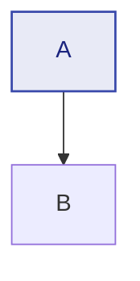
`fill`, `stroke`, `stroke-width`, `color`, `font-weight`, `font-style`, `stroke-dasharray` are the usual CSS props.

### `%%{init}` — global config (theme, size, per-type variables)
Must be the **first line** of the fence (no blank lines before). Single quotes inside the JSON.
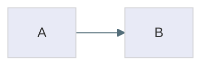
Per-type knobs (e.g. `gantt`, `sankey`, `architecture`, `xyChart`) go in `themeVariables.<type>` or the diagram's frontmatter `config:` block.

### Comments & direction
- `%% this is a comment` — comment out any line.
- `direction TD | TB | BT | LR | RL` — sets orientation (flowchart, state, subgraphs).
- Multi-line label: `A["Line 1<br/>Line 2"]` (flowchart) or backtick markdown `A["`**bold**`"]`.

---

# The 31 diagram types

## 1. Flowchart (or `graph`)
**Keyword:** `flowchart` (alias `graph`) · **Use when:** process, decision, flow-of-control.

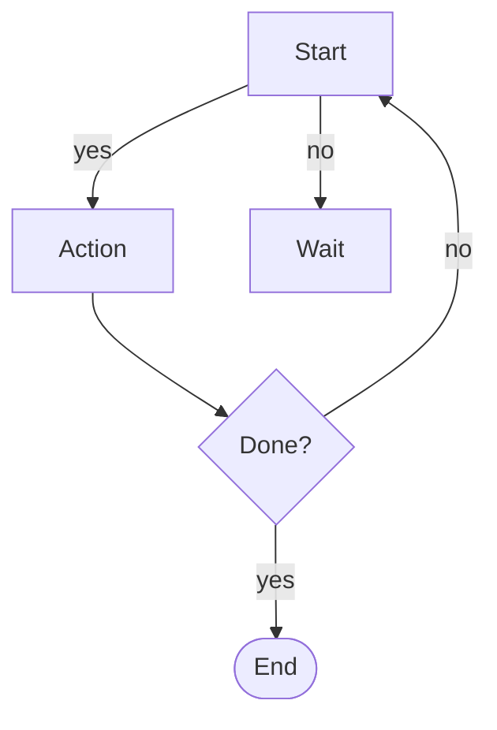
**Key features**
- Node shapes: `id` (box), `id[text]`, `id["quoted text"]`, `id{decision}` (diamond), `id(["stadium"])`, `id[(cylinder)]`, `id((circle))`, `id["`markdown`"]`.
- 30+ named shapes via `A@{ shape: rect }` (also `diamond`, `cyl`, `database`, `stadium`, `subproc`, `doc`, `hex`, …).
- Edges: `-->` arrow · `---` open · `-.->` dotted · `==> ` thick · `~~~` invisible · `--o-` open-circle end · `-x-` cross end · `-->|label|` labeled.
- `subgraph` with optional `direction` inside.
**Gotchas**
- Lowercase `end` **breaks** the chart — write `End`/`END`.
- A node ID starting with `o` or `x` (`A---oB`, `A---xB`) creates a *circle/cross edge* — add a space or capitalize.

## 2. Swimlanes
**Keyword:** `swimlane-beta` · **Use when:** flow across roles/teams.

```mermaid
swimlane-beta LR
  subgraph Customer
    Browse[Browse catalogue]
    Pay[Pay]
  end
  subgraph Warehouse
    Pick[Pick items]
    Ship[Ship order]
  end
  Browse --> Pay --> Pick --> Ship
```
**Key features**
- `swimlane-beta <dir>` (LR, TB, …) + `subgraph` per lane + `end`.
- Edges cross lanes the same as flowchart.
**Gotcha:** `-beta` suffix required; older examples without it may not render.

## 3. Sequence diagram
**Keyword:** `sequenceDiagram` · **Use when:** who calls whom, in order, over time.

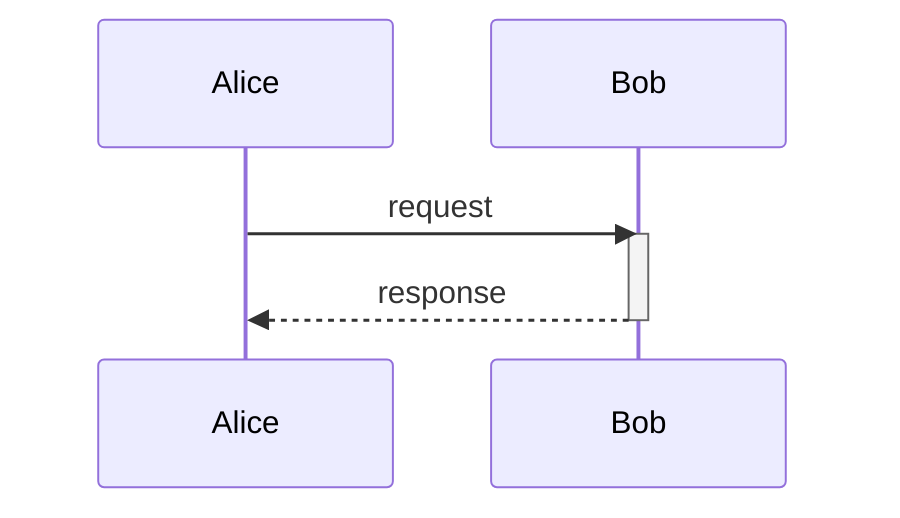
**Key features**
- **Messages:** `->>` sync · `-->>` sync reply · `-x>` async-failure · `->`/`-->` solid/dotted · `-)` async open arrow · (v11.0.0+) `<<->>` bidirectional.
- **Activations:** `activate B` / `deactivate B`, or `+`/`-` on the message (`A->>+B:` / `B-->>-A:`).
- **Blocks:** `rect` (highlight), `note over A,B`, `loop`, `alt ... else ... end`, `opt`, `par`, `break`, `critical`.
- **Actors/participants:** `actor`, `participant X as Label`, boundaries/controls/DB/database/collections/queue shapes, `autonumber`.
**Gotcha:** balance every `+` with a `-` (or `activate`/`deactivate`).

## 4. Class diagram
**Keyword:** `classDiagram` · **Use when:** UML classes & relationships.

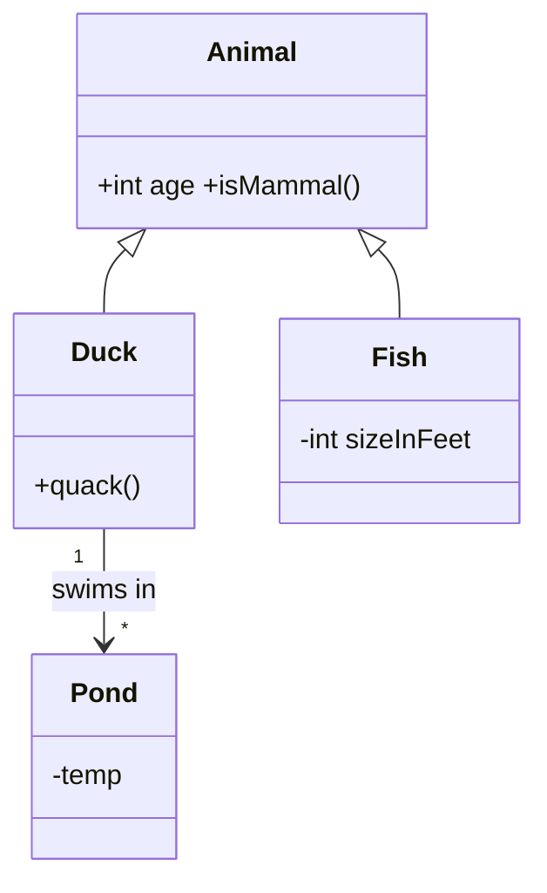
**Key features**
- **Relationships (8):** `<\|--` inheritance · `*--` composition · `o--` aggregation · `-->` association · `--` solid link · `..>` dependency · `..\|>` realization · `..` dashed link.
- Multiplicity in quotes: `"1" --> "*"`. Stereotypes `<<interface>>`/`<<abstract>>`.
- Fields with visibility `+ - #` and types; methods with parens.
- Notes: `note for Duck "..."`.
**Gotcha:** class fields use `+`/`-`/`#`; the relationship arrow direction matters.

## 5. State diagram
**Keyword:** `stateDiagram-v2` (also `stateDiagram`) · **Use when:** lifecycle / state machine.

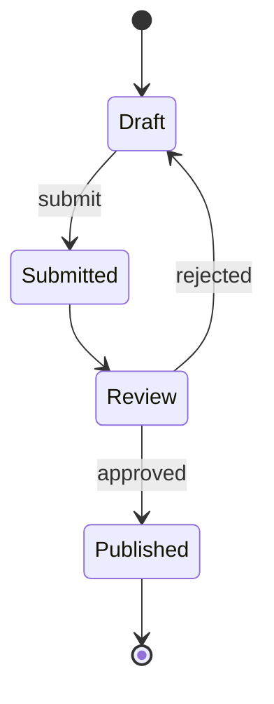
**Key features**
- Start/end are `[*]`. Transitions: `State --> State : label`.
- **Composite states:** `state Review { [*] --> Screening --> Decision }` (nestable).
- **Choice:** `state if_state <<choice>>` with multiple out-edges.
- **Concurrency:** `fork_state <<fork>>` / `join_state <<join>>`; inside a composite, `--` separators make parallel regions.
- `direction LR/TB/…`, `classDef` styles, notes.
**Gotcha:** `stateDiagram-v2` (with `-v2`) is the current syntax; transitions can't cross between different composites.

## 6. Entity-Relationship diagram
**Keyword:** `erDiagram` · **Use when:** data model / DB schema.

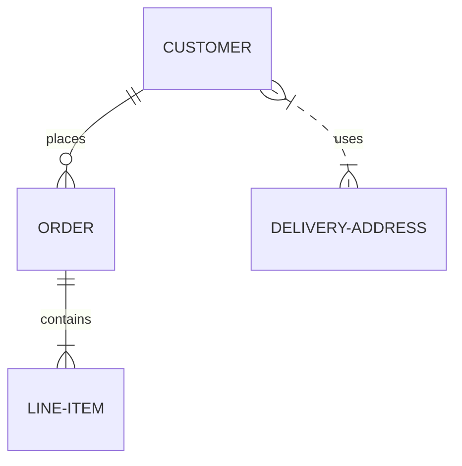
**Key features**
- Crow's-foot cardinality. Left marker = entity's cardinality w.r.t. the right, right marker = vice-versa.
- Solid line = **identifying** relationship (child needs parent); dashed `..` = **non-identifying**.
- Attributes: `ATTRIBUTE TYPE` inside an entity, e.g. `id INT PK`.
- Entity names are usually upper-case.
**Common cardinalities (left / right):** `|o`/`o|` zero or one · `||` exactly one · `}o`/`o{` zero or more · `}|`/`|{` one or more.
**Gotcha:** the two markers on each end are **two characters** (outer = max, inner = min).

## 7. User Journey
**Keyword:** `journey` · **Use when:** UX steps with satisfaction (1–5).

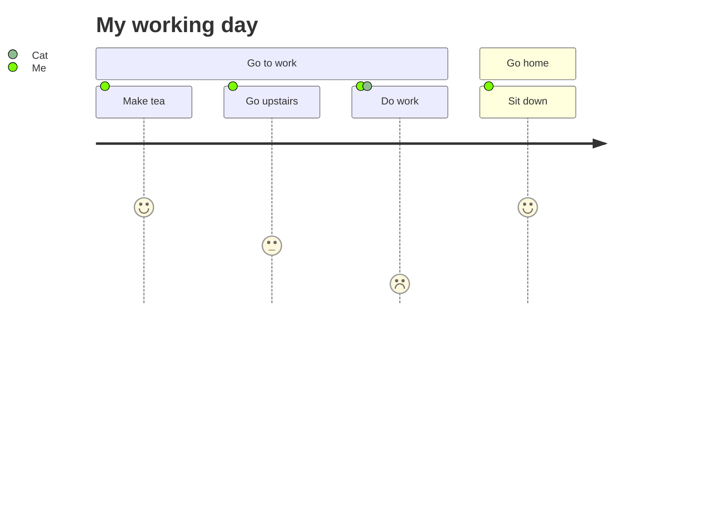
**Key features**
- `section <name>` groups; tasks are `Task: <score 1-5>: <actors>`.
- Actors comma-separated; score 1 (worst) → 5 (best).
**Use case:** showing the *as-is* workflow to reveal pain points.

## 8. Gantt
**Keyword:** `gantt` · **Use when:** project schedule / timeline.

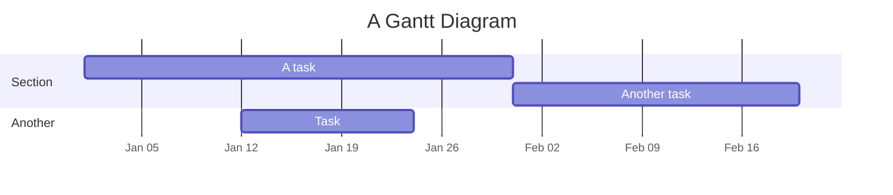
**Key features**
- `dateFormat` (input) + `axisFormat` (output, strftime).
- `section` groups; tasks `:id, start, duration` or `:after prev, duration`.
- **Milestones:** `: milestone, m1, 2014-01-15, 2d`.
- **Vertical markers:** `vert, v1, 2014-01-20, 1d`.
- `milestone`/`crit` styling, `#tag` classes.
**Gotcha:** durations support `d`, `w`, `m`, `q`, `y` and offsets (`+1 week`, `-2 days`).

## 9. Pie chart
**Keyword:** `pie` · **Use when:** parts of a whole.

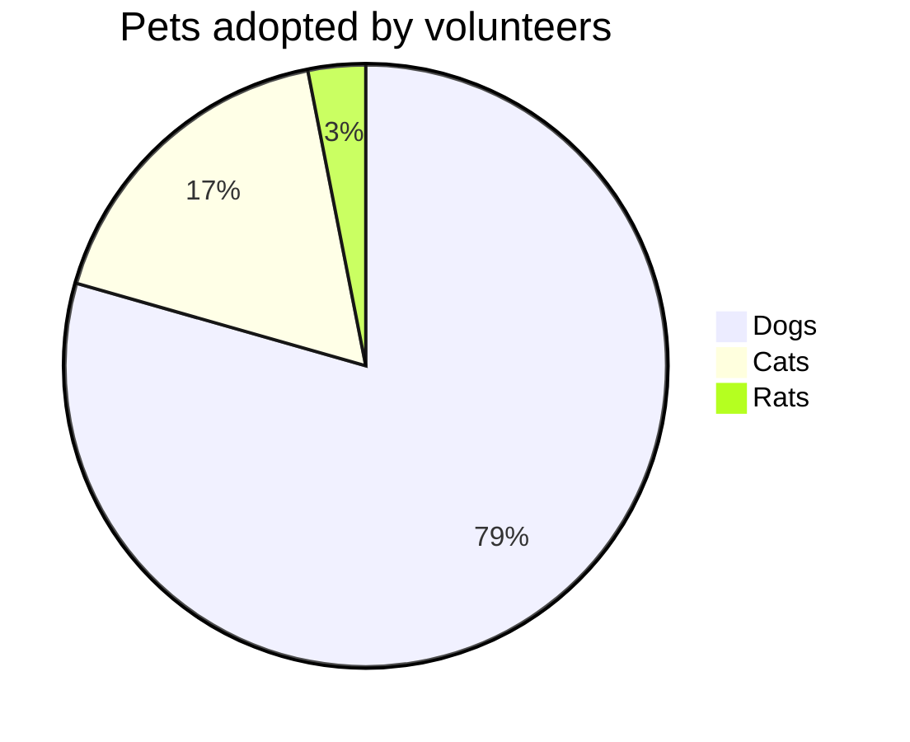
**Key features**
- Optional `title`. Slices `"Label" : value`.
- Config: `donut` (ring), `showDataLabels`, `showTotal`.
**Gotcha:** labels with spaces need quotes.

## 10. Quadrant chart
**Keyword:** `quadrantChart` · **Use when:** 2-axis positioning matrix.

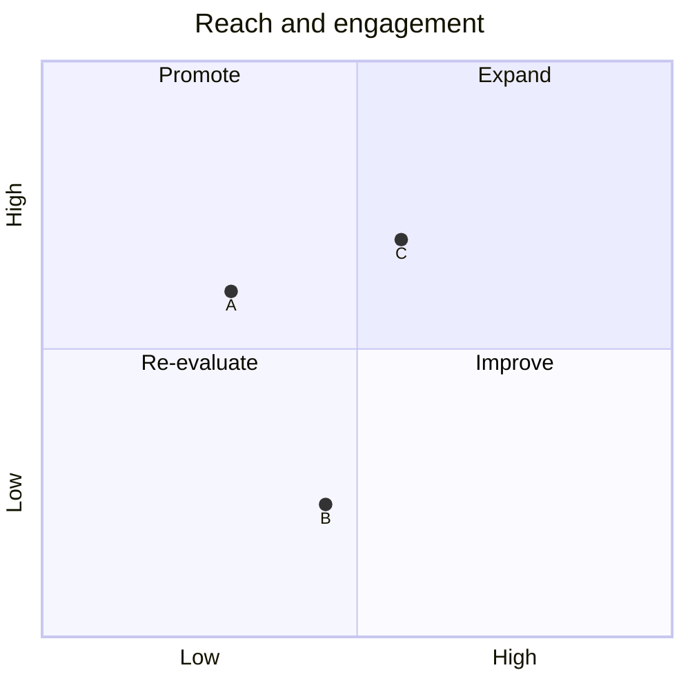
**Key features**
- Two axes with low→high labels; four `quadrant-N` labels; points `name: [x, y]` (0–1).
**Gotcha:** points are normalized 0–1, not raw values.

## 11. Requirement diagram
**Keyword:** `requirementDiagram` · **Use when:** requirements ↔ satisfying elements.

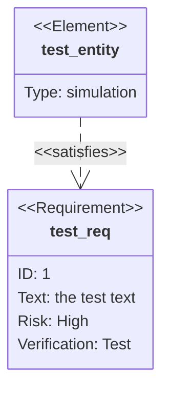
**Key features**
- `requirement` block (`id`, `text`, `risk`, `verifymethod`, …).
- `element` block (`type`, …).
- Relations: `satisfies`, `constrains`, `implements`, `extends`.
**Use case:** mapping features to components.

## 12. Use case diagram
**Keyword:** `usecase-beta` · **Use when:** UML use cases & actors.

```mermaid
usecase-beta
    actor Customer("Customer")
    systemBoundary "Order system"
        Checkout("Place order")
    end
    Customer --> Checkout
```
**Key features**
- `actor` (variants: `hollow`, `awesome`, icon), use cases (ellipse `()` / rectangle `[]`), `systemBoundary "label" … end`.
- **Relationships:** association `-->`/`--`, include `..> : include`, extend `..> : extend`, generalization `--|>`.
- Business slash (`business: true`), stereotypes `<<...>>`.
**Gotcha:** `-beta` suffix.

## 13. GitGraph
**Keyword:** `gitGraph` · **Use when:** git history / branches.

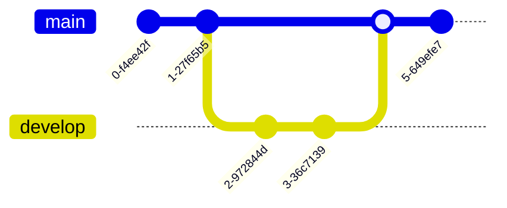
**Key features**
- `commit` (auto ID), `commit id:"x" tag:"v1" type:HIGHLIGHT`.
- `branch <name>`, `checkout <name>`, `merge <name>`, `cherry-pick <commit>`.
- Commit types: `NORMAL`, `REVERSE`, `HIGHLIGHT`.
- Config: orientation (`LR:`/`TB:`/`BT:`), `parallelCommits`, hide branch names.
**Gotcha:** branch names that look like keywords need quotes.

## 14. C4 diagrams
**Keywords:** `C4Context`, `C4Container`, `C4Component`, `C4Dynamic`, `C4Deployment` · **Use when:** C4 model (system → container → component).

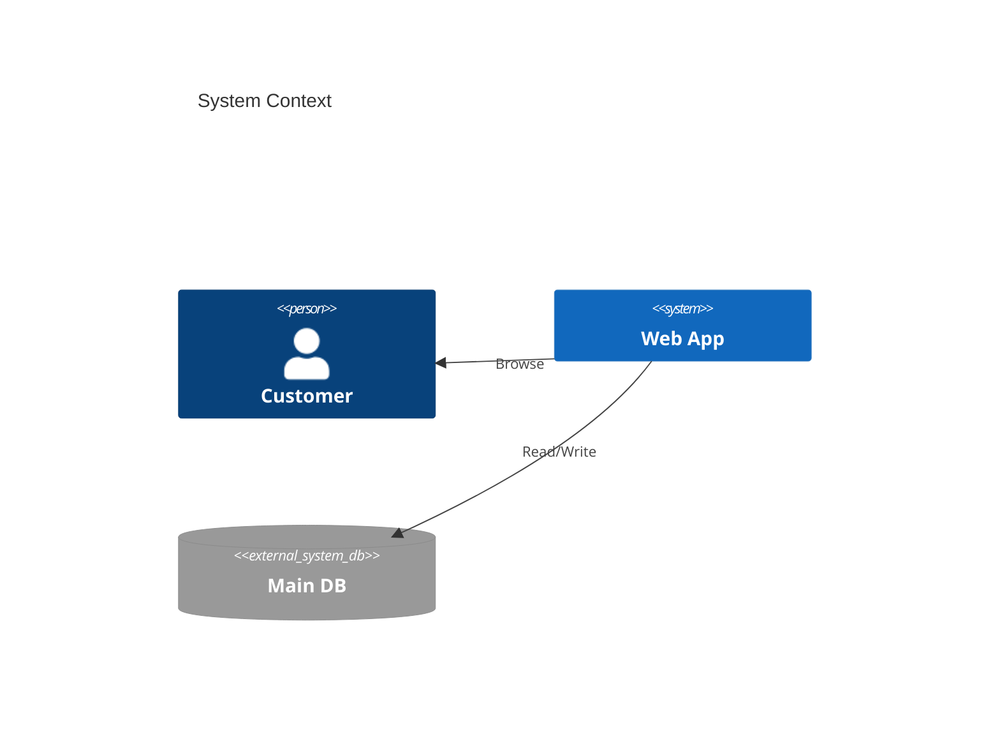
**Key features**
- 5 levels: **Context**, **Container**, **Component**, **Dynamic** (sequence-style), **Deployment**.
- Elements: `Person`, `System`, `SystemDb`, `SystemQueue`, `Container`, `Component`, `Boundary`, `Enterprise_Boundary`; `Rel(...)` relationships.
- Styling via `UpdateElementStyle`/`UpdateRelStyle` (fixed C4 palette).
- Layout is statement-order driven (no `Layout` directives).
**Gotcha:** **experimental** — syntax may change. PlantUML-compatible.

## 15. Mindmap
**Keyword:** `mindmap` · **Use when:** hierarchy / brainstorm.

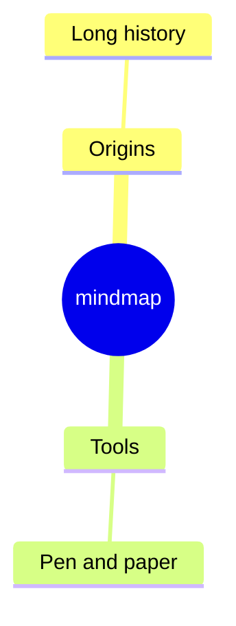
**Key features**
- Root `((id))`; indent for nesting; `::icon(fa fa-*)` adds an icon; `<br/>` for line breaks.
- `::icon` needs a registered icon font.
**Gotcha:** indentation is what defines hierarchy — keep it consistent.

## 16. Timeline
**Keyword:** `timeline` · **Use when:** history / chronological events.

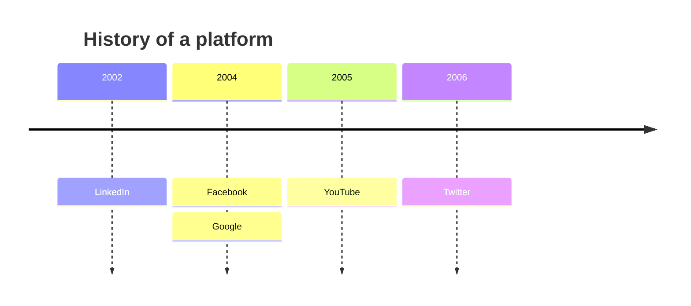
**Key features**
- `title` then `YYYY : event`; multiple events per year; `**bold**` for the main title line.
**Use case:** milestones, release history.

## 17. ZenUML
**Keyword:** `zenuml` · **Use when:** ZenUML-style sequence (alternative syntax).

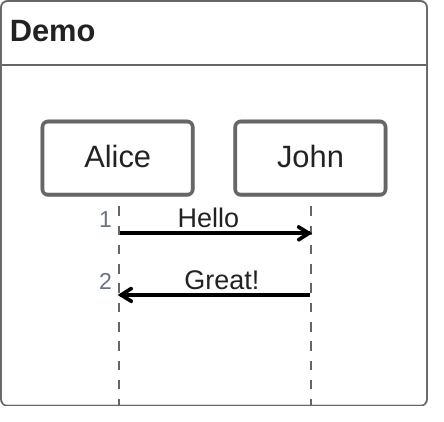
**Key features**
- `title`, participants (implicit or declared, or `@Actor`/`@Database` annotators), `as` aliases.
- Messages: sync, async, creation, reply.
**Note:** different syntax from the native `sequenceDiagram` — pick one.

## 18. Sankey
**Keyword:** `sankey` · **Use when:** flow volumes between stages.

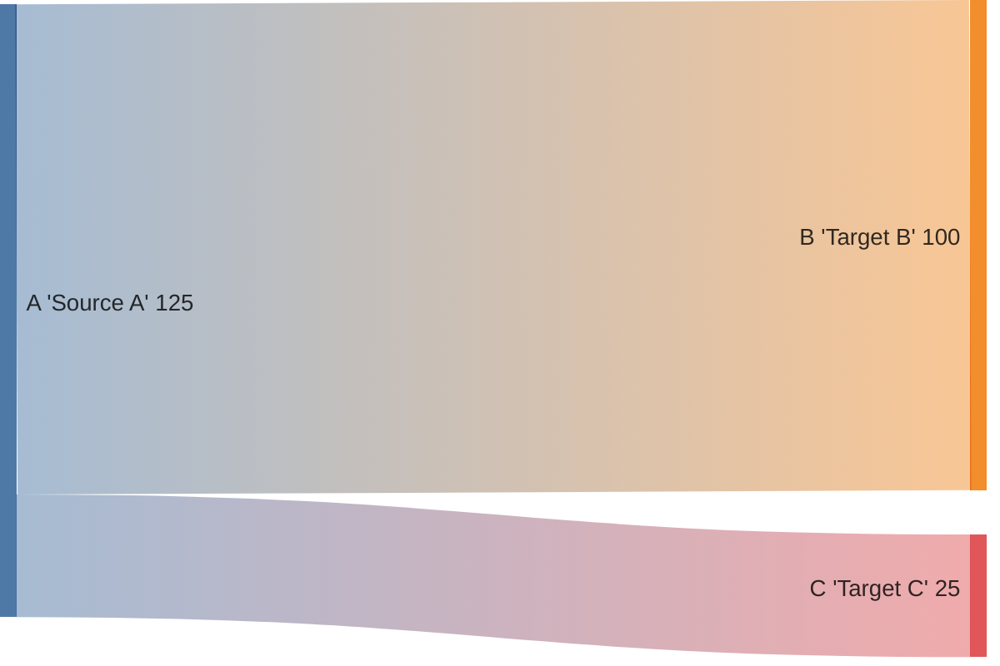
**Key features**
- Lines: `Source,Target,Value`. Names with spaces use `'` or `"`.
- Config: `showValues`, node width/padding, per-node color.
**Gotcha:** value drives the flow thickness; blank lines separate nodes.

## 19. XY chart
**Keyword:** `xychart` · **Use when:** bar / line / area chart.

```mermaid
xychart
    title "Sales Revenue"
    x-axis [jan, feb, mar, apr]
    y-axis "Revenue ($)" 0 --> 4000
    bar [1200, 1800, 1500, 2600]
    line [1300, 1900, 1600, 2700]
```
**Key features**
- `x-axis [cat1, cat2]`, `y-axis "label" min --> max` (both optional).
- `bar [values]`, `line [values]` (or named: `line "avg" [..]`).
- `xychart horizontal` for horizontal.
- Config: `plotColorPalette`, `titleColor`, `showDataLabel`.
**Gotcha:** multi-word values need `"`; line supports per-point labels.

## 20. Block diagram
**Keyword:** `block` · **Use when:** hardware / block layout.

```mermaid
block
    columns 3
    a b c
```
**Key features**
- `columns N` sets the grid.
- Shapes: `id` box, `id["label"]`, `id(("round"))`, `id[("cyl")]`, `id{["subproc"]} ` etc.
- `block:group` with nested `block`/`end`; widths `a:2`; `blockArrow`/space blocks; edges `A --> D`.
**Gotcha:** nested `block … end` for composite groups; widths span columns.

## 21. Packet
**Keyword:** `packet` · **Use when:** network packet bit layout.

```mermaid
packet
0-15: "Source Port"
16-31: "Dest Port"
32-63: "Sequence"
64-95: "Ack"
```
**Key features**
- `start-end: "field"` defines bit ranges; `single: "flag"` for 1 bit.
**Use case:** TCP/IP headers, protocol bitmaps.

## 22. Kanban
**Keyword:** `kanban` · **Use when:** tasks moving across stages.

```mermaid
kanban
  todo[Todo]
    t1[Write code]
  review[In Review]
  done[Done]
```
**Key features**
- Columns `id[Title]`; tasks indented `id[Desc]`.
- Metadata: `t1 @ { ticket: MC-1, assigned: 'me', priority: 'High' }` (priority: Very High/High/Low/Very Low).
**Note:** your `K8s-Syllabus.md` uses the separate Kanban *plugin* (frontmatter `kanban-plugin: board`), which is different from this diagram type.

## 23. Architecture
**Keyword:** `architecture-beta` · **Use when:** cloud / CI-CD service topology.

```mermaid
architecture-beta
    group api(cloud)[API]
        service db(database)[Database] in api
        service server(server)[Server] in api
        db:R --> L:server
```
**Key features**
- `group id(icon)[label] (in parent)` and `service id(icon)[label] (in group)`.
- **Edges with sides:** `db:R --> L:server`; directions `L R T B`; arrows `<`/`>`; group edges `server{group}:B --> T:subnet{group}`.
- **Junctions:** `junction j1` for 4-way splits.
- **Align (v11.16+):** `align row a b c` / `align column a b c` to stack parallel nodes.
- Config: `randomize`, `nodeSeparation`, `idealEdgeLengthMultiplier`, `seed`.
- Icons: built-in (`cloud`, `database`, `disk`, `internet`, `server`) or any iconify icon after registration.
**Gotcha:** `-beta` suffix.

## 24. Radar
**Keyword:** `radar-beta` · **Use when:** multi-axis scores.

```mermaid
radar-beta
    axis m["Math"], s["Science"], e["English"]
    curve a["Alice"] {85, 90, 80}
    curve b["Bob"] {70, 75, 85}
    max 100
    min 0
```
**Key features**
- `axis` (multiple per line), `curve name {v1, v2, …}` (must match axis order/count).
- `max`/`min`.
**Gotcha:** `-beta`; one number per axis.

## 25. Event Modeling
**Keyword:** `eventmodeling` · **Use when:** CQRS event flows (commands → events → read models).

```mermaid
eventmodeling
tf 01 ui CartUI
tf 02 cmd AddItem
tf 03 evt ItemAdded
```
**Key features**
- Time frames: `tf <n> <type> <id>` (or `timeframe`); types `ui`, `cmd`, `evt`, `pcr`/`processor`, `rmo`/`readmodel`.
- **Inline data:** `tf 02 cmd AddItem { description: string }`.
- **Data blocks:** `data AddItem01 { ... }` referenced by `[[AddItem01]]`.
- **Relations:** `tf 01 ui CartUI ->> 02` (multiple with chained `->>`).
**Gotcha:** each time frame needs a unique number; reuse of a number = error.

## 26. Treemap
**Keyword:** `treemap-beta` · **Use when:** hierarchical proportions.

```mermaid
treemap-beta
"Category A"
    "Item A1": 10
    "Item A2": 20
"Category B"
    "Item B1": 15
```
**Key features:** parent category, then indented `"item": value` children (area ∝ value).
**Gotcha:** `-beta`.

## 27. Venn
**Keyword:** `venn-beta` · **Use when:** set overlap.

```mermaid
venn-beta
    title What makes a good feature
    set Desirable
    set Feasible
    set Viable
    union Desirable,Feasible["Buildable"]
    union Desirable,Feasible,Viable["Ship it"]
```
**Key features:** `set Name` then `union A,B["label"]` for each overlap.
**Gotcha:** `-beta`.

## 28. Ishikawa
**Keyword:** `ishikawa-beta` · **Use when:** fishbone / root-cause.

```mermaid
ishikawa-beta
    Blurry Photo
    Process
        Out of focus
        Shutter too slow
    Equipment
        LENS
            Dirty lens
```
**Key features:** center = problem, first-level = cause categories, nested = specific causes.
**Gotcha:** `-beta`.

## 29. Wardley
**Keyword:** `wardley-beta` · **Use when:** strategy value chain.

```mermaid
wardley-beta
    title Tea Shop Value Chain
    anchor Business [0.95, 0.63]
    component Cup of Tea [0.79, 0.61]
    Business -> Cup of Tea
    evolve Kettle 0.62
    note "Note" [0.30, 0.49]
```
**Key features:** `anchor`/`component` with `[x, y]`, `->` chains, `evolve name value`, `note`.
**Gotcha:** `-beta`; coordinates are 0–1.

## 30. Cynefin
**Keyword:** `cynefin-beta` · **Use when:** problem-domain complexity.

```mermaid
cynefin-beta
    title Incident Response
    clear
        "Restart service"
    complicated
        "Analyze data"
    complex
        "Investigate root cause"
    chaotic
        "Page on-call"
```
**Key features:** domains `clear`, `complicated`, `complex`, `chaotic` (+ optional `confusion`).
**Gotcha:** `-beta`.

## 31. TreeView
**Keyword:** `treeView-beta` · **Use when:** file tree / nested hierarchy.

```mermaid
%%{init: {'themeCSS': '.treeView-node-label{fill:#77808d!important}.treeView-node-line{stroke:#77808d!important}'}}%%
treeView-beta
├── src/
│   ├── index.ts
│   └── utils.ts
└── package.json
```
**Key features:** literal `├──` / `│` / `└──` tree characters; indentation for nesting.
**Gotcha:** `-beta`; the tree is drawn from the literal glyphs. The SVG is transparent and the text/line colors are hard-coded **black** (theme-blind), so a plain treeView is invisible on dark backgrounds (GitHub/Obsidian dark mode). The `themeCSS` override above re-inks the labels/lines in a neutral gray (`#77808d`) that reads on both light and dark backgrounds.

---

# 2 newer types (develop, not yet on the public site)

## + AgentFlow
**Keyword:** `agentflow-beta` · **Use when:** LLM agent workflow (agents, tools, decisions).

```mermaid
agentflow-beta TB
    brief["Release brief"]@{ shape: input }
    flow writer["Drafting Agent"]
        draft["Draft notes"]@{ shape: task }
        lookup["changelog_search"]@{ shape: tool }
    end
    flow reviewer["Review Agent"]
        ok["Accurate?"]@{ shape: decision }
    end
    publish["Publish"]@{ shape: action }
    brief --> writer --> reviewer --> publish
```
**Key features**
- `flow <id>["name"]` groups sub-nodes; `@{ shape: input | task | tool | decision | refdoc | action }`.
- Edges `-->`, `-.>` (reference).
**Status:** newest; syntax likely to evolve.

## + Railroad (EBNF grammar)
**Keyword:** `railroad-ebnf-beta` · **Use when:** grammar / language spec.

```mermaid
railroad-ebnf-beta
    title "Digit"
    digit = "0" | "1" | "2" | "3" | "4" | "5" | "6" | "7" | "8" | "9" ;
```
**Key features**
- EBNF: `=` define, `|` or, `?` optional, `*`/`+` repeat, `( )` group, `;` end rule, `title`.
**Status:** newest; syntax likely to evolve.

---

# Appendices

## Flowchart node shapes (full list)
`rect` · `rounded` · `stadium` · `subproc` · `cyl` · `circle` · `odd` · `diamond` · `hex` · `lean-r` · `lean-l` · `datastore` · `trap-b` · `trap-t` · `dbl-circ` · `text` · `notch-rect` · `lin-rect` · `sm-circ` · `framed-circle` · `fork` · `hourglass` · `comment` · `brace-r` · `braces` · `bolt` · `doc` · `delay` · `das` · `lin-cyl` · `curv-trap` · `div-rect` · `tri` · `win-pane` … plus the classic bracket shapes `[]`, `()`, `{}`, `[]`, `(())`, etc.
Usage: `A@{ shape: diamond, label: "Decision" }`.

## ERD cardinality (crow's foot)
| Left entity | Right entity | Meaning |
|:-----------|:-------------|:--------|
| <code>&#124;&#124;</code> | <code>o{</code> | 1-to-zero-or-more |
| <code>&#124;&#124;</code> | <code>&#124;{</code> | 1-to-1-or-more |
| <code>}o</code> | <code>o{</code> | many-to-many |
| <code>&#124;&#124;</code> | <code>&#124;&#124;</code> | 1-to-1 |
Solid line = identifying (child can't exist without parent); dashed `..` = non-identifying.

## Class relationship arrows
`<\|--` inheritance · `*--` composition · `o--` aggregation · `-->` association · `--` solid link · `..>` dependency · `..\|>` realization · `..` dashed link.

## Sequence message arrows
`->` solid no-arrow · `-->` dotted no-arrow · `->>` solid arrow · `-->>` dotted arrow · `<<->>` / `<<-->>` bidirectional (v11.0.0+) · `-x` solid cross · `--x` dotted cross · `-(` solid open (async) · `--)` dotted open (async).

## Edge types (flowchart)
`-->` arrow · `---` open · `-.->` dotted · `===>` thick · `~~~` invisible · `--o-` open-circle · `-x-` cross · `-->|label|` labeled · `== text ==>` thick labeled.

---

## Further reading
- **Full docs:** <https://mermaid.ai/open-source> (each type has its own page under *Diagram Syntax*).
- **GitHub rendering docs** (incl. the `info` trick for checking the bundled version): <https://docs.github.com/en/get-started/writing-on-github/working-with-advanced-formatting/creating-diagrams>
- **Mermaid Live Editor:** <https://mermaid.ai/live/edit> — paste, render, tweak.
- **Mermaid releases** (which types shipped in which version): <https://github.com/mermaid-js/mermaid/releases>
- **Mermaid CLI** (export to SVG/PNG for READMEs etc.): `npx -y @mermaid-js/mermaid-cli@12.1.0 -i in.mmd -o out.svg` — pin the version you tested with.
---
*Reference generated from `mermaid-js/mermaid` develop (v12.1.x). Diagram types marked `-beta`/Experimental may change — re-check the page for anything you rely on heavily.*
